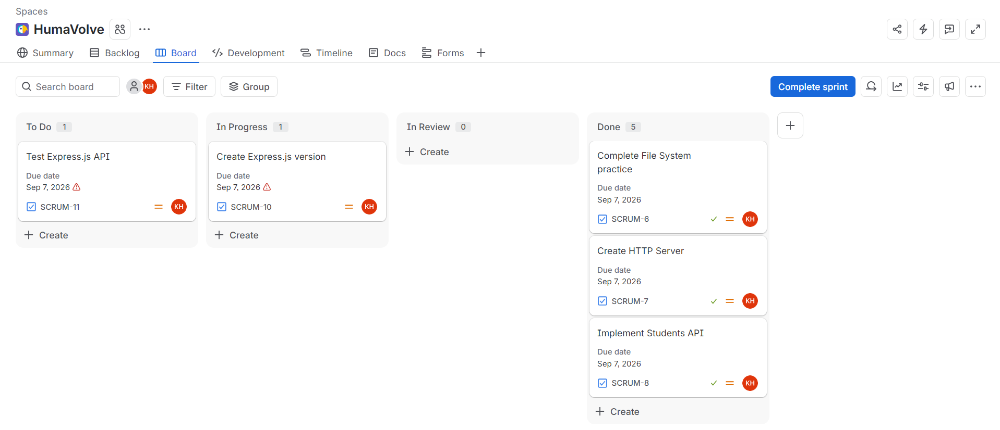

# Node.js & Express.js Assignment – Day 1

Node.js Training — Huma Volve

Khaled Hassan Farooq

07 Sep 2026 - Monday

---

## Part 1: Research — File System Module Methods

### `fs.readFile()`

**What it does:** Reads the entire contents of a file asynchronously. If you provide an encoding such as `utf8`, the result is a string; otherwise, it is returned as a `Buffer`.

**Syntax:**

```jsx
fs.readFile(path, options, callback)
```

**Example:**

```jsx
const fs = require('fs');

fs.readFile('notes.txt', 'utf8', (err, data) => {
  if (err) {
    console.error('Could not read file:', err);
    return;
  }

  console.log(data);
});
```

**When an error occurs:** `err` is passed to the callback and `data` is not usable. Common causes include a missing file, invalid path, or insufficient permissions. Handle the error before using `data`.

### `fs.writeFile()`

**What it does:** Writes data to a file asynchronously. By default, it creates the file if it does not exist and replaces the existing contents if it already exists.

**Syntax:**

```jsx
fs.writeFile(file, data, options, callback)
```

**Example:**

```jsx
const fs = require('fs');

fs.writeFile('notes.txt', 'Hello Node.js!', 'utf8', (err) => {
  if (err) {
    console.error('Could not write file:', err);
    return;
  }

  console.log('File written successfully');
});
```

**When an error occurs:** `err` is passed to the callback. The write operation should be treated as unsuccessful. Possible causes include an invalid path, permission problems, or file-system errors.

### `fs.appendFile()`

**What it does:** Adds data to the end of a file asynchronously without replacing the existing contents. If the file does not exist, it is created by default.

**Syntax:**

```jsx
fs.appendFile(path, data, options, callback)
```

**Example:**

```jsx
const fs = require('fs');

fs.appendFile('app.log', 'Application started\n', 'utf8', (err) => {
  if (err) {
    console.error('Could not append to file:', err);
    return;
  }

  console.log('Content appended');
});
```

**When an error occurs:** `err` is passed to the callback and the append operation should be considered unsuccessful. Typical causes are permission issues, an invalid path, or other file-system errors.

### `fs.unlink()`

**What it does:** Deletes a file asynchronously. It removes the directory entry for the specified file path.

**Syntax:**

```jsx
fs.unlink(path, callback)
```

**Example:**

```jsx
const fs = require('fs');

fs.unlink('notes.txt', (err) => {
  if (err) {
    console.error('Could not delete file:', err);
    return;
  }

  console.log('File deleted successfully');
});
```

**When an error occurs:** `err` is passed to the callback and the file is not successfully deleted. A common case is trying to delete a file that does not exist (`ENOENT`), but permissions or an invalid path can also cause failure.

## Part 2: File System Practice

Code: part2_fileSystem.js

**Terminal output:**

```bash
File written successfully
Hello Huma Volve!
Content appended
Hello Huma Volve!
this is a new line
File deleted successfully
```

---

## Part 3: HTTP Module Practice

Code: part3_server.js

**Postman testing:**

### GET /students

GET request

```json
[
{
"id": 1,
"name": "Ahmed",
"age": 20
},
{
"id": 2,
"name": "Sara",
"age": 21
}
]
```

### POST /students

POST request

```json
[
    {
        "id": 1,
        "name": "Ahmed",
        "age": 20
    },
    {
        "id": 2,
        "name": "Sara",
        "age": 21
    },
    {
        "id": 3,
        "name": "Mona",
        "age": 22
    }
]
```

### PUT /students

PUT request

```json
{
    "id": 1,
    "name": "Ahmed Updated",
    "age": 25
}
```

### DELETE /students

DELETE request

```json

```

---

## Part 4: Express.js Practice

Code: part4_express.js

**Postman testing:**

### GET /students

GET request

```json
[
    {
        "id": 1,
        "name": "Ahmed",
        "age": 20
    },
    {
        "id": 2,
        "name": "Sara",
        "age": 21
    }
]
```

### POST /students

POST request

```json
{
    "success": true,
    "data": {
        "id": 3,
        "name": "Mona",
        "age": 22
    }
}
```

### PUT /students

PUT request

```json
{
    "success": true,
    "data": {
        "id": 1,
        "name": "Ahmed Updated",
        "age": 25
    }
}
```

### DELETE /students

DELETE request

```json

```

### GET /random

GET request

```json
{
    "success": false,
    "message": "Route not found"
}
```

---

## Part 5: Jira Practice



---

## Part 6: LinkedIn Post

**Post link:** [KhaledNILCareer](https://www.linkedin.com/posts/khalednilcareer_humavolve-backenddevelopment-nodejs-activity-7502771407802589186-fbX3)